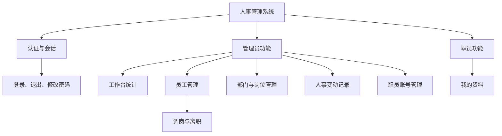

# 功能结构图源文件

```mermaid
flowchart TD
  System[人事管理系统]
  System --> Auth[认证与会话]
  Auth --> Login[登录、退出、修改密码]
  System --> Admin[管理员功能]
  Admin --> Dashboard[工作台统计]
  Admin --> Employees[员工管理]
  Employees --> Transfer[调岗与离职]
  Admin --> Dictionary[部门与岗位管理]
  Admin --> Changes[人事变动记录]
  Admin --> Accounts[职员账号管理]
  System --> Employee[职员功能]
  Employee --> Profile[我的资料]
```
