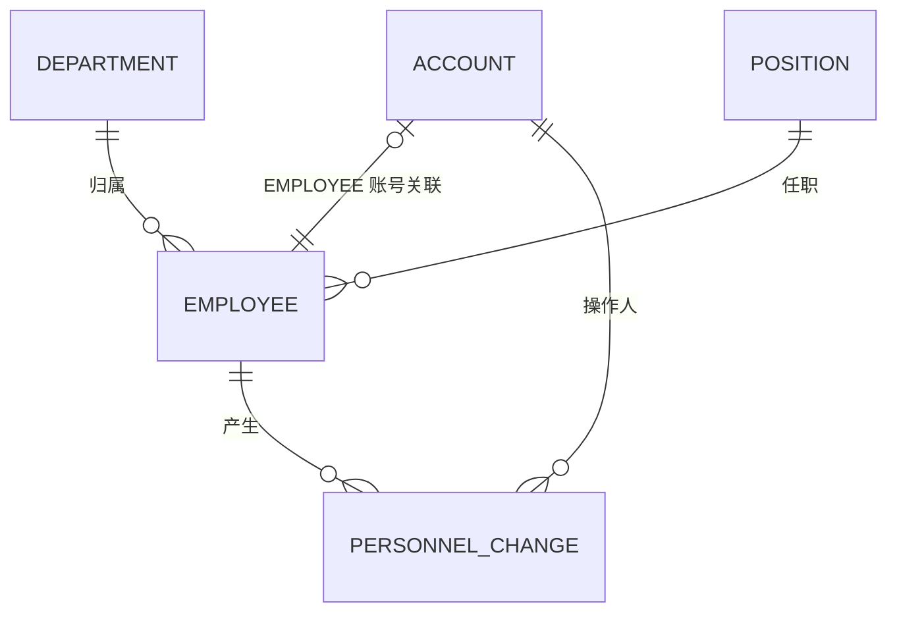

# 人事管理系统数据模型

## 1. 存储策略

当前开发与联调阶段使用后端内存存储，服务重启后恢复初始虚构演示数据。所有数据访问应收敛到 Repository 接口；后续由组员以 MySQL 实现替换内存实现，保持业务服务和接口稳定。

## 2. 实体

| 实体 | 主要字段 | 约束与说明 |
| --- | --- | --- |
| Account（账号） | username、passwordHash、role、employeeId、enabled、credentialVersion | username 唯一；role 为 ADMIN 或 EMPLOYEE；EMPLOYEE 必须且仅可关联一个员工，员工最多关联一个职员账号；密码只存哈希。 |
| Employee（员工） | id、employeeNo、name、phone、email、address、education、departmentId、positionId、hireDate、status、createdAt、updatedAt | id、employeeNo 唯一；departmentId、positionId 必须有效；status 为 ACTIVE 或 RESIGNED。 |
| Department（部门） | id、name、description、createdAt、updatedAt | id、name 唯一；被员工或变动历史引用时禁止删除。 |
| Position（岗位） | id、name、description、createdAt、updatedAt | id、name 唯一；独立于部门；被引用时禁止删除。 |
| PersonnelChange（人事变动） | id、type、employeeId、beforeDepartmentId、beforePositionId、afterDepartmentId、afterPositionId、occurredAt、reason、operatorUsername | type 为 ONBOARD、TRANSFER、RESIGNATION；结构化保存部门、岗位变动前后值；记录不可修改和删除，并作为部门、岗位删除校验的历史引用。 |
| SessionToken（会话） | token、username、issuedAt、credentialVersion、expiresAt | 仅内存保存；退出、停用、密码变更时失效。 |

## 3. 关联

员工新增产生入职事件；调岗同时更新员工的 departmentId、positionId 并写入前后快照；离职同时更新 status、写入事件、停用关联职员账号。上述操作必须在同一业务事务边界中完成。

## 4. 枚举与校验

| 枚举 | 值 | 含义 |
| --- | --- | --- |
| Role | ADMIN、EMPLOYEE | 管理员、职员 |
| EmployeeStatus | ACTIVE、RESIGNED | 在职、离职 |
| ChangeType | ONBOARD、TRANSFER、RESIGNATION | 入职、调岗、离职 |
| AccountStatus | ENABLED、DISABLED | 可登录、已停用 |

手机号、邮箱在保存时进行格式校验；账号、工号、部门名、岗位名去除首尾空格后判定唯一；密码长度至少 8 位，实际规则可在安全设计中增强。
