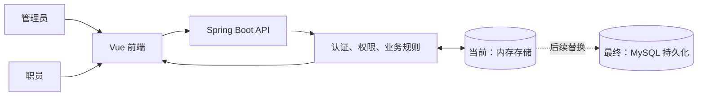

# 数据流图源文件

```mermaid
flowchart LR
  Admin[管理员] --> UI[Vue 前端]
  Staff[职员] --> UI
  UI --> API[Spring Boot API]
  API --> Auth[认证、权限、业务规则]
  Auth <--> Memory[(当前：内存存储)]
  Memory -. 后续替换 .-> MySQL[(最终：MySQL 持久化)]
  Auth --> UI
```

当前数据存储为后端进程内存；最终由 MySQL Repository 实现替换，前端 API 保持兼容。
